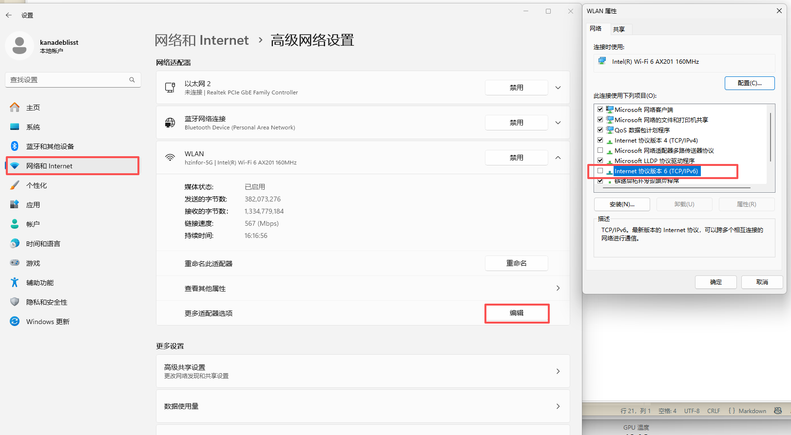

### 常见问题

#### 进了群聊还显示验证失败怎么办

通常有以下原因：

1. 微信版本不对，目前只支持4.1.1.19版本
2. 电脑安装了360，拦截了软件的hook，关了或者加白名单再试试
3. 当前微信账号没有在交流群里
4. 微信多开了没有识别到准确的微信进程

#### 微信会自动更新怎么办

hosts文件里加入以下两行：

```
127.0.0.1   dldir1.qq.com
127.0.0.1   dldir1v6.qq.com
```

禁用电脑的ipv6功能，操作如下：


